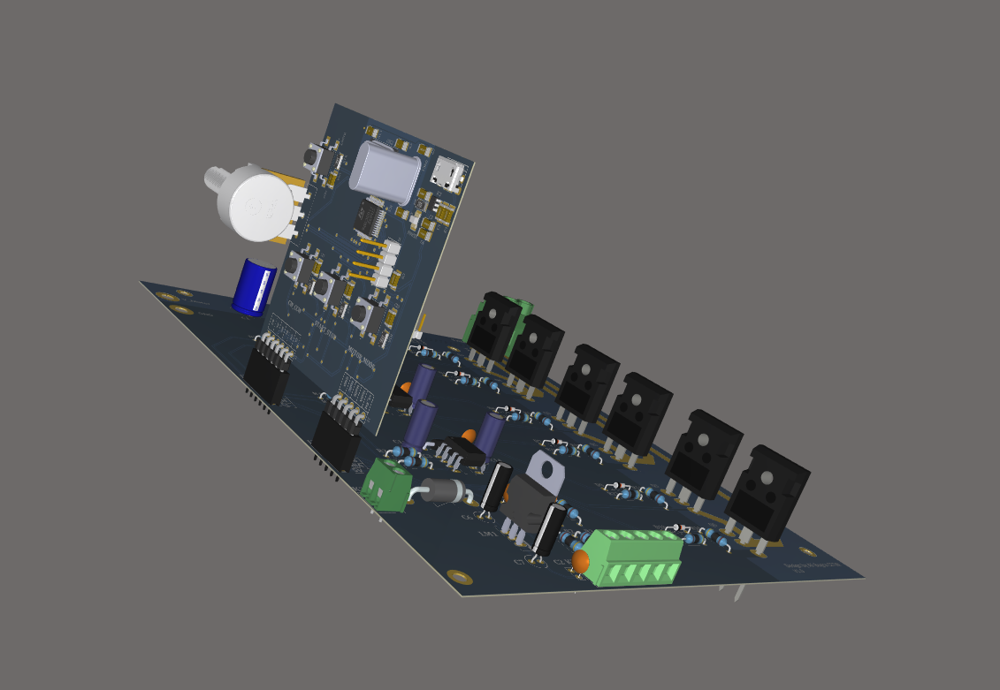
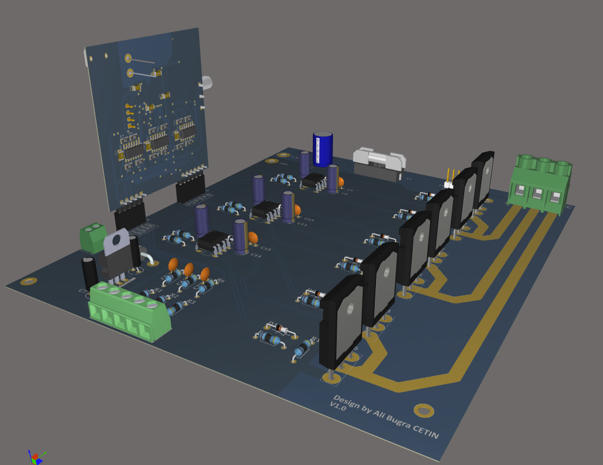

# BLDC Motor Sürücü Tasarım ve Yazılımı

Bu çalışma Elektronik mühendisliği bitirme tezim olarak hazırlanmıştır.
Bu çalışma yapılırken takım arkadaşım Ahmet Serhat AYKILIÇ ile birlikte yapılmıştır.

## Tanıtım

Bu çalışmada kullanılan POWER_Board ile 500V 20A (25 Derece) için uygun güç anahtarları kullanılmıştır. 
PCB çizilirken Faz hatları SolderMask uygulandı. Bu sayede Faz hatlarını güçlendirelirisiniz. 
Anahtarları uygun zamanlarda iletime/yalıtıma geçirmek için STM32F103C8T6 işlemcisi kullanıldı.
3 adet Pull-Up bağlı butonlar ile başlatma yada durdurma, yön ve mod kontrolü yapılmaktadır.
Eklenen potansiyometre ile güç anahtarların Gate-Source gerilimi basitçe değiştirilmektedir.
MCU kartında STM32F103C8T6 programlama işlemi Header ile yapılmaktadır.

#Driver MCU

#Power MCU

